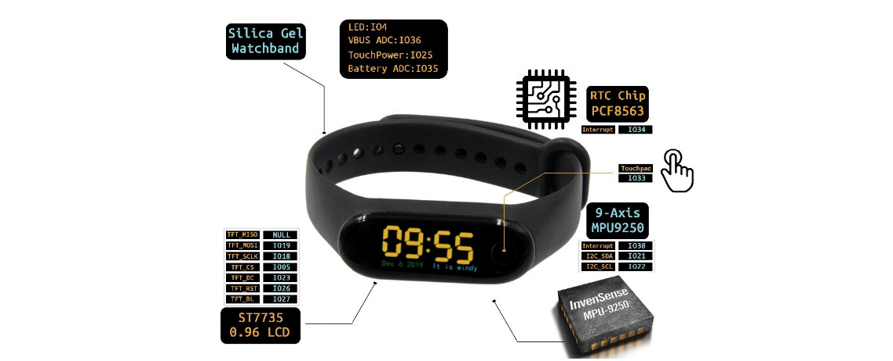

<p align="center"><a href="https://github.com/Rymond3/LilyGO_T-Wristband"></a></p>

# LilyGO_T-Wristband
Step by step guide to program the LilyGO-ttgo-twristband 

## Step by Step guide for cable Flashing

When I bought LilyGO's T-Wristband I had no idea how to start programming it, and the guides given where not very helpful. So here we are, I'm going to explain step by step how to start coding your wristband. We will use [Arduino IDE](https://www.arduino.cc/en/software), so install it if you haven't already.

1. First of all, you have to access [LilyGO's T-Wristband github repository](https://github.com/Xinyuan-LilyGO/LilyGo-T-Wristband) and clone it. You can do this in several ways:

	1. In the [repo](https://github.com/Xinyuan-LilyGO/LilyGo-T-Wristband) click the green `Code` button and select `Download ZIP`. This will download a ZIP file which you will need to unzip.
	2. Install [git](https://git-scm.com/downloads) and access a terminal and type the following command:
```
git clone https://github.com/Xinyuan-LilyGO/LilyGo-T-Wristband.git
```

2. Now you will have a folder with the repository contents. Access it and copy the contents of the `libdeps` folder into the `C:\<UserName>\Documents\Arduino\libraries\` directory, which is where the default Arduino libraries are stored. Access the `C:\<UserName>\Documents\Arduino\libraries\TFT_eSPI-master` folder and edit the `User_Setup_Select.h` file. Comment the `#include <User_Setup.h>` line and uncomment the line `#include <User_Setups/Setup26_TTGO_T_Wristband.h>`. The result should look like the following image. Save the file.


3. Now download the following ZIP files. In my case, I saved them in the `C:\<UserName>\Documents\Arduino\` directory:
	- https://github.com/Bodmer/TFT_eSPI/archive/master.zip
	- https://github.com/lewisxhe/PCF8563_Library/archive/master.zip

4. Next, open the Arduino IDE and select `Sketch`-> `Include Library` -> `Add .ZIP library` and select the two ZIP files you downloaded in the previous step.

5. Now you will need to open the wristband, just follow the instructions manual bellow. It may seem a bit difficult, but you will manage to open it in the end.


6. The next step is to distinguish between the two types of sensors your wristband may have. It can either be LSM9DS1 or MPU9250, check the following image to know which one is yours. The differences are subtle, but with just a few seconds you will find them.


7. Now that you know what type of wristband you have, in Arduino IDE select `File`-> `Open`. Now you have to traverse to the local T-Wristband repository (the one cloned in step 1) and enter the `examples` directory. There you will find several directories that follow this format: `T-Wristband-<version>`. Access the one that corresponds to the version of your wristband; mine was `T-Wristband-MPU9250`. Finally, select the `T-Wristband-<version>.ino` file; once again, mine was `T-Wristband-MPU9250.ino`.

8. Now you have to install the board; you can follow [this guide](https://randomnerdtutorials.com/installing-the-esp32-board-in-arduino-ide-windows-instructions/) if you face any problems. Go to `File` -> `Preferences` and add this URL to the `Additional Boards Manager URLs` field: https://dl.espressif.com/dl/package_esp32_index.json. Then select `OK`.


9. The next step is to select `Tools` -> `Board` -> `Board Manager...` and type esp32. Then press `Install`. Once installed, go to `Tools` -> `Board` -> `ESP32 Arduino` and select `ESP32 Dev Module`.


10. Next, you have to install the necessary drivers. As there are several types of serial communication boards, you will need to check their type. The type can be seen either on the chip or on the back of the board. It can either be a `CP21xx` or a `CH340`; mine is a `CH340C`.


11. Depending on the type, download the specific driver:
	- [CP21xx Drivers](https://www.silabs.com/products/development-tools/software/usb-to-uart-bridge-vcp-drivers)
	- [CH340 Drivers](http://www.wch-ic.com/search?q=ch340&t=downloads)

12. In my case, I accessed `CH340 Drivers` and downloaded `CH341SER.EXE`. You can follow [this guide](https://learn.sparkfun.com/tutorials/how-to-install-ch340-drivers/all) if you face any problems. Basically you have to run the .exe file, select `UNINSTALL` and then `INSTALL`.

13. Now you have to connect the wristband to the computer. To do this, first you have to connect the wristband to the serial communication board as in the following image.


13. Now connect the serial communication board to the host using a cable (it can be a USB type C or USB micro a). To check if the board has been recognized by the drivers you can either: 
	1. go to the Arduino IDE and select `Tools`. The `Port` option should be accessible, and you will be able to see the connected board.
	
	
	
	2. go to Window's Device Manager utility. You should be able to see the board under the `Ports (COM & LPT)` drop-down.
	
	

14. In the Arduino IDE select `Tools` -> `Port` and select the board. In my case it's `COM4`.

15. The last step is to flah the code into the wristband. To do this, press Arduino's `Upload` button. Congrats, you have been able to flash the code into the wristband! Now you can change the source code to your liking.


Now that you have come this far, I strongly recommend you to follow the following guide, because you will save precious time.

## Step by Step guide for OTA Flashing

Now you may wonder if every time you change the code you will have to open the wristband. Don't worry, the answer is no. Here I will teach you how to upload your code via WiFi to the wristband.

1. First of all, you have to go to the `T-Wristband-MPU9250.ino` code and uncomment the `#define ARDUINO_OTA_UPDATE` line. Now upload the code into the wristband and press the wirstband's button. You will see a message on the wristband's screen: 
```
Connect hospot name
T-Wristband
configure wrist
```

2. This cryptic message tells you to connect via WiFi to the wristband. Go to your WiFi settings and look for a network called T-Writband. In my case I could not find the network on my computer, but it showed up on my smartphone. In my case, once i connected to it, a notification popped up alerting me that I had to log in, so I clicked it and it redirected me to the page bellow. In case you don't get this pop-up window, open a browser and, in the URL field, type `192.168.4.1` and hit enter.


3. Now you have to press `Configure WiFi` and select the WiFi access point you use on your computer. You will need to enter its credentials if it's a private network. Once you have entered them, the wristband's screen should change. Now, in Arduino IDE you should be able to go to `Tools` -> `Port` and see that under `Network ports` there is an entry called `T-Wristband...`. Select it.


4. Once the wristband's network port is selected, upload the code. In my case, a firewall alert appeared asking to grant permission to `espota.exe`. Give permission to both the private and public networks, because if you don't, you will get a `No response from device` error. In the Arduino IDE console you will see `Sending invitation to <IP>` printed. If everything goes well, it will also print `Uploading.....` and your wristband's screen will change to the following:


5. Congratulations! Now you can ditch the serial communication board and reassemble the wristband. You now know how to seamlessly upload your code into the wristband. Now it's the moment you've been waiting for - happy coding!
